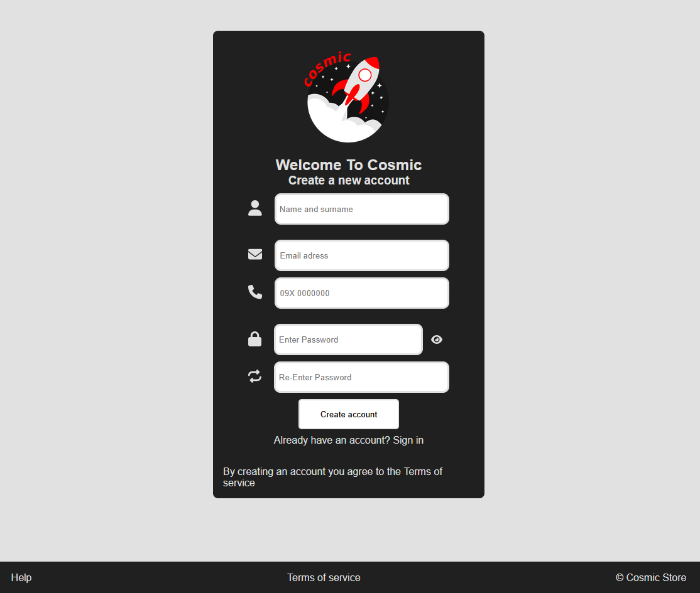
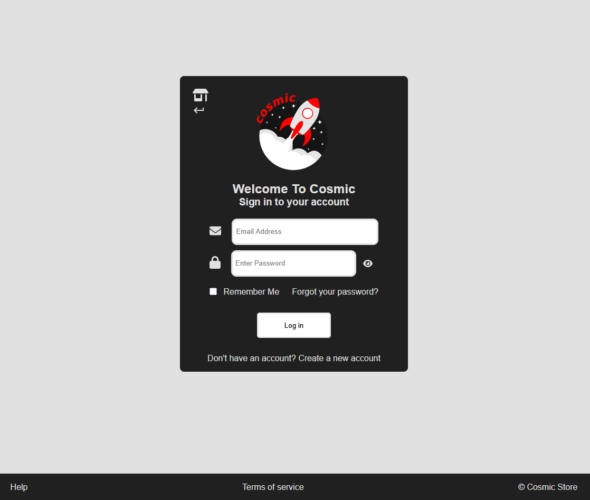
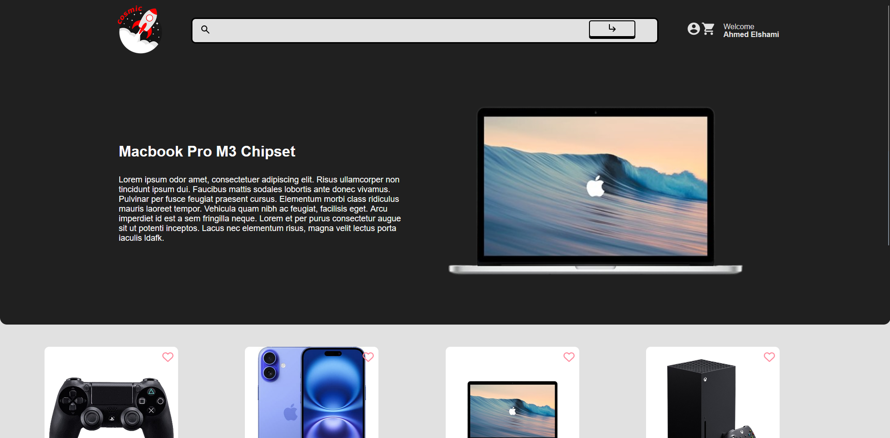
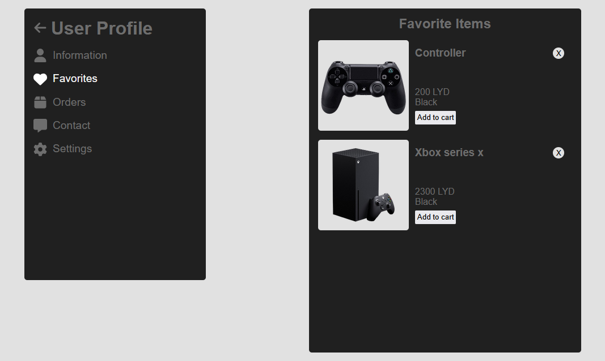
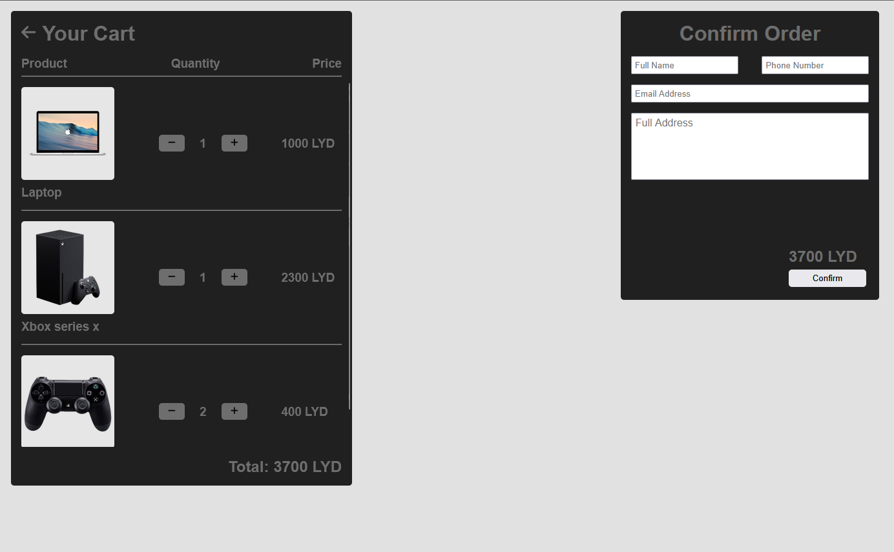

# Cosmic Store

Made with:

**This is a free and open source eccommerce web app**.

## Features

- User Authentication: Secure login and registration functionality for customers.

  
  

- Product Display: Products are displayed in an attractive, easy-to-navigate grid.

- Responsive Design: The website is fully responsive, working seamlessly across all devices (desktop, tablet, mobile).

- Search & Filters: Search for products based on categories, brands, price ranges, and more.

- Users can construct a wishlist of desired items to be purchased in the future.

- Checkout Process: A streamlined checkout system with order summary and payment integration.

- Shopping Cart: Users can add/remove items to/from their shopping cart.

## Usage
1. Clone this repository,
`git clone https://github.com/DeadMoza/CosmicDashboard.git`
2. Add your firebase project to the app by follwing these
[instructions](https://firebase.google.com/docs/web/setup).
3. If you want to use the official [Cosmic Dashboard](https://github.com/DeadMoza/CosmicDashboard) to manage your app then you should repeat step #1 for this step as well.
4. Populate the firebase backend using your preferred manager and finally publish your website.

MIT License.